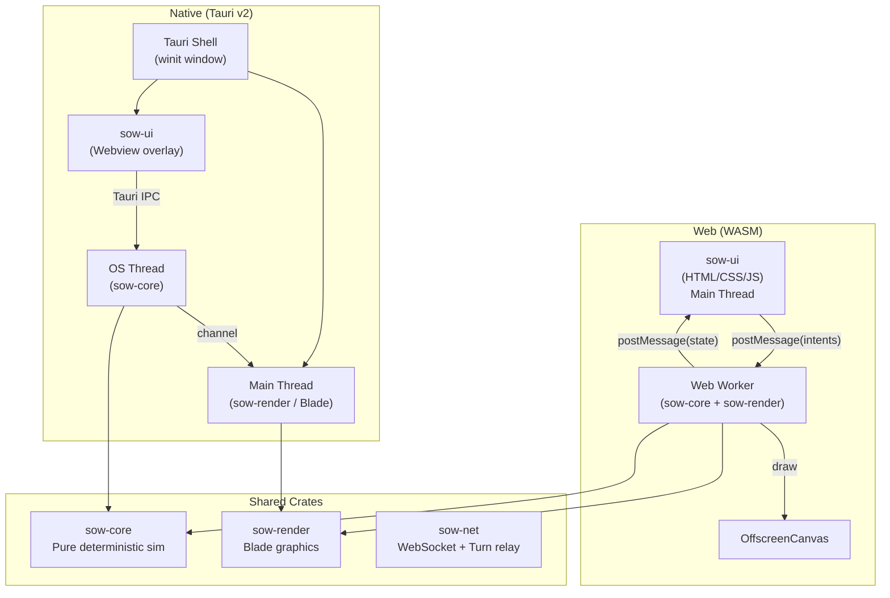

# Shadows of War — Full Remake Plan

A performance-first remake of Dark Rift (OpenFront RTS) using **Blade** for graphics, **Tauri** for native distribution, **HTML/CSS/JS** for all UI, and **Web Workers** for WASM multithreading. The game ships to Web (WASM), Desktop (Linux/Mac/Win), and Mobile (iOS/Android via Tauri v2).

## What We're Remaking

Dark Rift is a ~15,800 LOC Rust codebase across 5 crates. Here's what exists and what moves where:

| Dark Rift Crate | LOC | Shadows of War Destination |
|---|---|---|
| `shared` (simulation) | ~5,200 | `sow-core` — pure Rust, zero Bevy deps |
| `client/rendering` | ~700 | `sow-render` — Blade shaders, no Bevy ECS |
| `client/ui` | ~4,800 | `sow-ui` — **rewritten entirely in HTML/CSS/JS** |
| `client/gameplay` | ~1,800 | Split: sim logic → `sow-core`, input → `sow-ui` |
| `client/network` | ~600 | `sow-net` — pure Rust WebSocket client |
| `server` | ~1,600 | `sow-server` — pure Rust server (no Bevy) |
| `map-generator` | ~400 | `sow-tools` — CLI map generator |

### What Gets Deleted Entirely
- All `bevy::prelude::*` imports and Bevy `Plugin`, `Resource`, `Component`, `System` patterns
- All `lightyear` networking (replaced with raw WebSocket + turn relay)
- All `bevy_ui` / `bevy_text` / `Mesh2d` / `ColorMaterial` rendering code
- Bevy asset pipeline (`Handle<Mesh>`, `Handle<Image>`, `.meta` files)

---

## Architecture



---

## Workspace Structure

```
/home/bizkit/Github/openfrontio/shadows-of-war/
├── Cargo.toml                    # Workspace root
├── sow-core/                     # Pure deterministic simulation
│   └── src/
│       ├── lib.rs
│       ├── map.rs                # GameMap, MapTile, TerrainType
│       ├── player.rs             # Player, PlayerId, border_tiles
│       ├── game.rs               # GameState, GamePhase, GameEvent
│       ├── engine.rs             # SowEngine (replaces DarkRiftEngine)
│       ├── config.rs             # Balance constants
│       ├── combat.rs             # AttackExecution, PrioritizedTile
│       ├── fleet.rs              # WarpFleet, FleetRoute, water pathfinding
│       ├── building.rs           # Building, DefenseGrid, placement
│       ├── intent.rs             # GameplayIntent, StampedIntent, Turn
│       ├── income.rs             # Troop/gold income per tick
│       ├── pathfinding.rs        # A*, water component BFS
│       ├── bitset.rs             # DenseBitSet
│       ├── rng.rs                # Deterministic WyRand
│       ├── bot.rs                # Bot/Nation AI logic
│       └── checksum.rs           # Cross-client determinism verification
│
├── sow-render/                   # Blade-powered rendering
│   └── src/
│       ├── lib.rs
│       ├── context.rs            # Blade GPU context (native + WASM)
│       ├── map_renderer.rs       # Territory tilemap (texture upload)
│       ├── fleet_renderer.rs     # Fleet boat sprites
│       ├── building_renderer.rs  # Structure sprites
│       ├── camera.rs             # Pan/zoom (replaces Bevy Camera2d)
│       └── shaders/              # WGSL shaders (water, borders, etc.)
│
├── sow-net/                      # Pure WebSocket networking
│   └── src/
│       ├── lib.rs
│       ├── protocol.rs           # Turn, StampedIntent, ServerStart
│       └── client.rs             # WebSocket connect/send/recv
│
├── sow-ui/                       # Vite + Vanilla TS frontend
│   ├── package.json
│   ├── vite.config.ts
│   ├── index.html
│   └── src/
│       ├── main.ts               # Boot: load WASM, spawn worker
│       ├── worker.ts             # Web Worker entry (loads WASM module)
│       ├── bridge.ts             # postMessage protocol types
│       ├── lobby/                # Lobby browser, player list
│       ├── hud/                  # Combat HUD, build menu, leaderboard
│       ├── settings/             # Settings panel
│       └── styles/               # CSS design system
│
├── sow-wasm/                     # wasm-bindgen entry point
│   └── src/
│       └── lib.rs                # Exports: init(), tick(), render()
│
├── sow-native/                   # Tauri v2 desktop/mobile app
│   ├── Cargo.toml
│   ├── tauri.conf.json
│   ├── build.rs
│   └── src/
│       └── main.rs               # Tauri setup, spawn sim thread
│
├── sow-server/                   # Standalone relay server
│   └── src/
│       ├── main.rs
│       ├── lobby.rs              # Lobby management
│       └── relay.rs              # Turn bundling + broadcast
│
└── sow-tools/                    # Map generator CLI
    └── src/
        └── main.rs
```

---

## Crate Details

### `sow-core` — The Brain (Zero External Dependencies)

> [!IMPORTANT]
> **No Bevy. No std I/O. No allocations in the hot loop.**
> This crate must compile to `wasm32-unknown-unknown` with zero platform dependencies.

**What moves from Dark Rift `shared`:**

| Dark Rift File | Action | Notes |
|---|---|---|
| `game.rs` (281 LOC) | **Port** | Strip `bevy::prelude::Resource`. Keep `GameState`, `GamePhase`, `GameEvent`, `BuildingKind` |
| `engine.rs` (92 LOC) | **Port** | Strip `bevy::prelude::Resource`. Rename `DarkRiftEngine` → `SowEngine` |
| `map.rs` (153 LOC) | **Port** | Strip `bevy::prelude::Resource`. Keep `GameMap`, `MapTile`, `TerrainType` exactly |
| `player.rs` (209 LOC) | **Port** | Strip `bevy_prng::WyRand` → use `wyrand` crate directly |
| `execution/combat.rs` (409 LOC) | **Port** | Strip `bevy::prelude::*`. Logic is pure — moves cleanly |
| `execution/income.rs` (250 LOC) | **Port** | Pure math, trivial port |
| `execution/mod.rs` (104 LOC) | **Port** | `AttackExecution`, `PrioritizedTile` — pure data |
| `warp_fleet.rs` (587 LOC) | **Port** | Already pure Rust (no Bevy deps in logic). Move as-is |
| `pathfinding.rs` (284 LOC) | **Port** | Already pure. A* + BFS scratch buffers |
| `intent/` (all 6 files) | **Port** | Strip `bevy::log::warn!` → use `log` crate |
| `building/` (all 7 files) | **Port** | Pure math + data. Trivial port |
| `bitset.rs`, `rng.rs`, `checksum.rs` | **Port** | Already pure |
| `config.rs`, `game_config.rs` | **Port** | Strip `bevy::prelude::Resource` |
| `protocol.rs` | **Split** | Data types → `sow-core`. Lightyear Plugin → **delete** |
| `water_components.rs` | **Port** | Pure BFS flood-fill. No deps |

**Bevy constructs to strip:**
- `use bevy::prelude::*;` → delete
- `#[derive(Resource)]` → delete  
- `#[derive(Component)]` → delete
- `bevy_prng::WyRand` → `wyrand` crate
- `bevy::log::warn!` → `log::warn!`
- `lightyear::prelude::*` → delete (replace with `sow-net`)

---

### `sow-render` — The Eyes (Blade Graphics)

> [!WARNING]
> This is the most technically challenging crate. Blade's WASM support uses WebGPU (not WebGL). We need to validate that the target browsers support WebGPU, or fall back to a `wgpu` backend.

**What we're replacing:**

| Dark Rift (Bevy) | Shadows of War (Blade) |
|---|---|
| `Mesh2d` + `ColorMaterial` sprites | Blade vertex buffers + instanced draw |
| Bevy `Camera2d` + `OrthographicProjection` | Custom 2D camera matrix (uniform buffer) |
| `bevy_render` texture upload (`Image`, `gpu_image`) | Blade `create_texture` + `write_texture` |
| Bevy `Material2d` shaders | WGSL shaders compiled by Blade's `naga` |
| `Transform` + `GlobalTransform` for positioning | Instance buffer with `[x, y, scale, color]` per entity |

**Rendering pipeline:**
1. **Map Layer** — Full-screen quad with a `u16[]` texture (owner IDs). Fragment shader looks up player color from a uniform array and applies territory alpha/border darkening. This replaces the CPU-heavy tilemap update loop.
2. **Fleet Layer** — Instanced circle quads. One draw call for all boats.
3. **Building Layer** — Instanced quads with texture atlas. One draw call per building type.
4. **VFX Layer** — Attack rings, conquest animations. Particle-style instancing.

---

### `sow-ui` — The Face (HTML/CSS/JS)

**What we're replacing:**

| Dark Rift (bevy_ui, 4800 LOC) | Shadows of War (HTML/CSS) |
|---|---|
| `lobby_browser.rs` (1903 LOC!) | `lobby/` — HTML tables, CSS animations, JS WebSocket |
| `hud_combat.rs` (883 LOC) | `hud/combat.ts` — DOM elements overlaid on canvas |
| `hud_events.rs` (628 LOC) | `hud/events.ts` — Toast notifications via CSS transitions |
| `setup.rs` (582 LOC) | `main.ts` — Boot sequence, WASM loading |
| `hud_build.rs` (234 LOC) | `hud/build.ts` — Build menu with CSS grid |
| `shell.rs` (315 LOC) | `hud/shell.ts` — Top bar, resource display |
| `leaderboard.rs` (251 LOC) | `hud/leaderboard.ts` — Sorted HTML table |
| `labels.rs` (204 LOC) | Canvas overlay via `sow-render` (not DOM) |
| `theme.rs`, `layers.rs`, `anim.rs` | `styles/` — CSS variables, z-index system |

**Communication Bridge (JS ↔ WASM):**
```typescript
// bridge.ts — Message types between UI thread and Worker
interface ToWorker {
  type: 'attack' | 'build' | 'fleet' | 'cancel' | 'input';
  payload: any;
}
interface FromWorker {
  type: 'state_update' | 'event';
  payload: {
    tick: number;
    myPlayer: { troops: number; gold: number; tileCount: number };
    players: PlayerSummary[];
    events: GameEvent[];
  };
}
```

---

### `sow-net` — The Nerves (Pure WebSocket)

Replaces `lightyear` entirely. The turn-relay model is dead simple:

1. Client connects via WebSocket
2. Client sends `GameplayIntent` as JSON/bincode
3. Server stamps with `player_id`, bundles into `Turn`
4. Server broadcasts `Turn` to all clients
5. Each client feeds `Turn.intents` into `sow-core` deterministic `tick()`

---

## Threading Model

### WASM (Web Workers)

```
┌─────────────────────────────────┐
│ Main Thread (Browser)           │
│                                 │
│  sow-ui (HTML/CSS/JS)           │
│  - Lobby, HUD, Settings         │
│  - Captures mouse/keyboard      │
│  - postMessage(intent) ────────►│──┐
│  ◄──── postMessage(state) ──────│──┤
│                                 │  │
└─────────────────────────────────┘  │
                                     │
┌─────────────────────────────────┐  │
│ Web Worker                      │◄─┘
│                                 │
│  sow-core (WASM)                │
│  - Deterministic tick() loop    │
│  - 100ms lockstep               │
│                                 │
│  sow-render (WASM + Blade)      │
│  - Renders to OffscreenCanvas   │
│  - WebGPU backend               │
│                                 │
│  sow-net (WASM)                 │
│  - WebSocket in worker context  │
└─────────────────────────────────┘
```

### Native (OS Threads)

```
┌─────────────────────────────────┐
│ Main OS Thread                  │
│                                 │
│  Tauri + winit event loop       │
│  sow-render (Blade Vulkan/Metal)│
│  sow-ui (Webview overlay)       │
│                                 │
│  ◄── mpsc::channel ────────────►│──┐
└─────────────────────────────────┘  │
                                     │
┌─────────────────────────────────┐  │
│ Spawned OS Thread               │◄─┘
│                                 │
│  sow-core tick() loop           │
│  sow-net WebSocket              │
│  Sends state snapshots via chan  │
└─────────────────────────────────┘
```

---

## Phased Execution Plan

### Phase 0: Scaffold (Day 1)
- [ ] Create `/home/bizkit/Github/openfrontio/shadows-of-war/`
- [ ] Initialize workspace `Cargo.toml` with all crates
- [ ] Scaffold all Rust crates with placeholder `lib.rs`
- [ ] Initialize `sow-ui` Vite project
- [ ] Verify `cargo check` passes on empty workspace

### Phase 1: Port `sow-core` (Days 2-4)
- [ ] Copy `shared/src/map.rs` → strip Bevy deps → `sow-core/src/map.rs`
- [ ] Port `player.rs` — replace `bevy_prng::WyRand` with `wyrand`
- [ ] Port `game.rs`, `game_config.rs`, `config.rs` — strip `Resource` derives
- [ ] Port `engine.rs` — rename `DarkRiftEngine` → `SowEngine`
- [ ] Port `bitset.rs`, `rng.rs`, `checksum.rs` — already pure
- [ ] Port `pathfinding.rs`, `water_components.rs` — already pure
- [ ] Port `execution/` (combat, income) — strip `bevy::prelude::*`
- [ ] Port `intent/` — strip `bevy::log` → `log` crate
- [ ] Port `building/` — strip Bevy deps
- [ ] Port `warp_fleet.rs` — already pure
- [ ] Port `protocol.rs` — data types only, delete Lightyear Plugin
- [ ] Write integration test: `cargo test -p sow-core` passes

### Phase 2: Wire `sow-render` with Blade (Days 5-7)
- [x] Add `blade-graphics` dependency
- [x] Implement `RenderContext` (Blade init for native window handle)
- [x] Implement territory map texture (u16 owner ID array → GPU texture)
- [x] Write WGSL fragment shader for territory coloring
- [x] Implement 2D camera (pan/zoom via uniform buffer)
- [x] Verify: native window shows colored territory

### Phase 3: Build `sow-ui` Web Frontend (Days 8-10)
- [x] Design CSS system (dark theme, glassmorphism, responsive)
- [x] Build lobby browser (HTML tables, WebSocket connection)
- [x] Build combat HUD (troops bar, gold, build menu)
- [x] Build leaderboard (sorted table, auto-update)
- [x] Implement `bridge.ts` (postMessage protocol)

### Phase 4: WASM Web Worker Integration (Days 11-13)
- [x] Setup `wasm-bindgen` in `sow-wasm`
- [x] Implement `WorkerMsg` (serialization of intents)
- [x] Write `worker.ts` wrapper in UI
- [x] Setup lockstep `sow-core` inside WASM worker
- [x] Verify: `npm run dev` boots Web Worker without crashes

### Phase 5: Tauri Native Shell (Days 14-15)
- [x] Setup Tauri v2 in `sow-native`
- [x] Connect `sow-native` directly to `sow-core` + `sow-render` (bypassing WASM)
- [x] Inject Webview over `sow-render` background
- [x] Verify: `cargo run -p sow-native` boots the hybrid desktop app
- [x] Test: game runs natively with HTML UI overlay

### Phase 6: Networking (Days 16-17)
- [x] Implement `sow-net` WebSocket client (tokio-tungstenite / web-sys)
- [x] Connect WebSocket directly in `sow-native` and `sow-wasm`
- [x] Create simple Echo server in `sow-net/examples/server.rs`
- [x] Verify: both Web Worker and Tauri shell can ping the server

### Phase 7: Server & Tools (Days 18-19)
- [x] Implement `sow-server` using tokio WebSocket listener
- [x] Connect `sow-server` to `sow-core` for server-side auth/state
- [x] Migrate map gen scripts to `sow-tools` (headless)
- [x] Finalize the full architecture end-to-end!

### Phase 8: Gameplay Migration (Active)
- [x] Port `tick_bots` into `sow-core/src/engine.rs` (using fast `DenseBitSet` $O(B)$ lookup for borders)
- [x] Port Canvas 2D fallback rendering and Web Worker `Uint16Array` memory bridge in `sow-ui`
- [x] Implement basic UI Camera panning and zooming in `main.ts`
- [ ] Port UX interaction overlay (The "Home" button, minimap)
- [ ] Connect Real-time HUD elements (Troops, Gold, Leaderboard) in Javascript layer
- [ ] Port Human `GameplayIntent` interaction (Click-to-Attack) correctly into WASM pipeline
- [ ] Port `warp_fleet` and water pathfinding mechanics

---

## Open Questions

> [!IMPORTANT]
> **1. Blade WebGPU on WASM:** Blade's WASM support targets WebGPU, which requires Chrome 113+, Edge 113+, or Firefox Nightly. Safari support is experimental. Is this acceptable, or should we use `wgpu` as a safer fallback for broader browser compatibility? (wgpu also supports WebGL2 as a fallback.)

> [!IMPORTANT]
> **2. UI Framework:** The plan uses Vanilla TypeScript for `sow-ui`. This keeps the bundle tiny (~10KB) and gives us max performance. But the lobby browser alone was 1903 LOC in Bevy — complex state management in vanilla TS can get messy. Would you prefer a lightweight framework like **Svelte** or **Preact** (~3KB) to keep things organized?

> [!IMPORTANT]
> **3. Map Rendering Approach:** Dark Rift currently uploads a full RGBA texture every frame for territory visualization. Should we switch to a GPU-compute approach where the owner ID buffer lives on the GPU and territory colors are resolved entirely in the fragment shader? This would eliminate the CPU→GPU texture upload bottleneck that caused the frame spikes we fought in the old engine.

> [!WARNING]
> **4. `f64` Determinism:** The existing combat code uses `f64` for troop calculations. We've seen cross-platform divergence issues between ARM-WASM and x86-WASM with negative/zero edge values. Should we migrate to **fixed-point integer math** in `sow-core` from day one to guarantee bit-exact determinism? This is more work upfront but eliminates an entire class of desync bugs.
